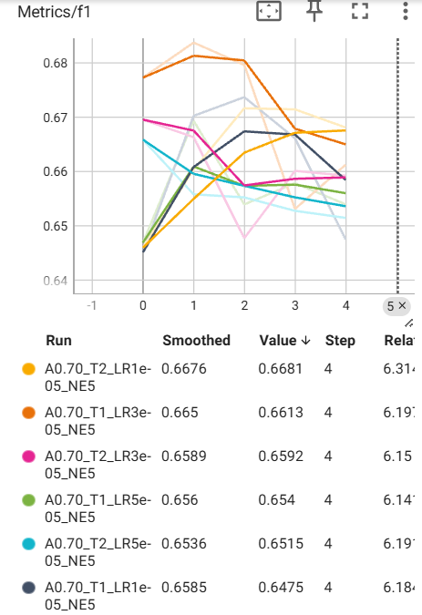
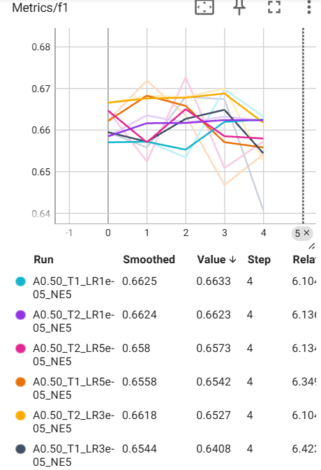

# DistilBERT

## Student Model (DistilBERT)

- The student model has the same configuration as the teacher model, but with half the number of layers.
- Initialize the layers of student model. Copy one out of two encoder layers, and all other layers from the teacher model.

## Loss Function
$$\mathcal{L} = \alpha \mathcal{L}_\text{cls} + \beta  $$

Classification Loss $\mathcal{L}_\text{cls}$: hard label supervision

KD Loss $\mathcal{L}_\text{KD}$: soft label distillation

Cosine Embedding Loss $\mathcal{L}_{\text{cos}}$: alignment of hidden representations

## Hyper Parameters
| Hyperparameter    | Value                      |
|-------------------|----------------------------|
| Epochs            | 3                          |
| Learning Rate     | 3e-5                       |
| Optimizer         | AdamW                      |
| Weight Decay      | 0.01                       |
| Scheduler         | cosine                     |
| Loss Weights      | alpha = 0.7, beta=0.2      |
| Evaluation Metric | F1-score (macro), Accuracy |

## Results
| Model      | F1-score | Accuracy | Compression |
|------------|----------|----------|------------------|
| Student    | 0.673    | 0.682    | 0.611            |
| BERT       | 0.674    | 0.690    | 1                |
